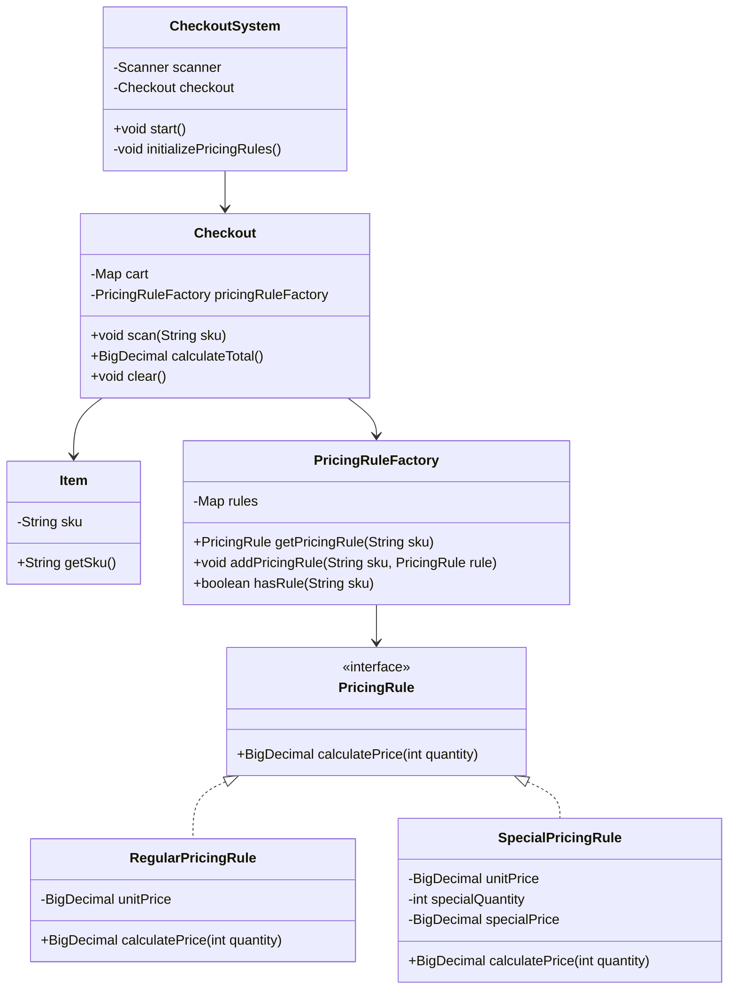

# CDL Checkout System

This project implements a checkout system for a supermarket, handling various pricing schemes including special offers.

## UML Class Diagram




## Prerequisites

- Java 11 or higher
- Maven

## Building the Project

To build the project, run the following command in the project root directory:

```
mvn clean package
```

This will compile the code, run the tests, and create a JAR file in the `target` directory.

## Running the Application

To run the application, use the following command:

```
java -cp target/checkout-system-1.0-SNAPSHOT.jar com.cdl.CheckoutSystem
```

## Using the Checkout System

1. When prompted, enter the SKU of an item (A, B, C, or D) and press Enter.
2. To finish the current checkout and see the total, enter 'done'.
3. To exit the application, enter 'quit'.

## Running Tests

To run the unit tests, use the following command:

```
mvn test
```

## Pricing Rules

The current pricing rules are as follows:

- Item A: 50 pence each, or 3 for £1.30
- Item B: 30 pence each, or 2 for 45 pence
- Item C: 20 pence each
- Item D: 15 pence each

## Project Structure

- `src/main/java/com/cdl/checkout/`: Contains the main application code
- `src/test/java/com/cdl/checkout/`: Contains the unit tests
- `pom.xml`: Maven configuration file
